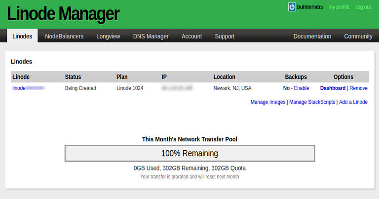
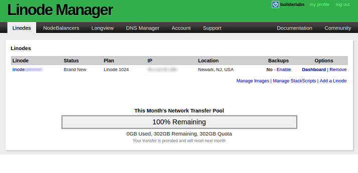
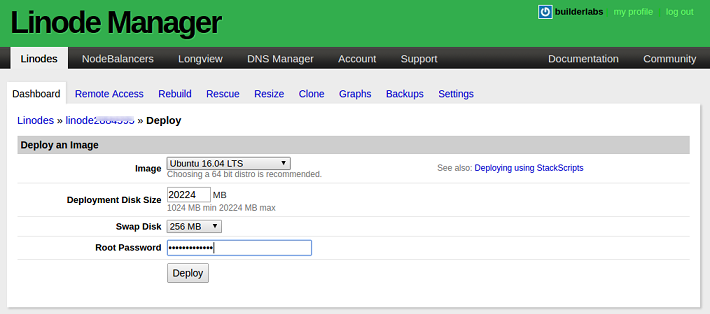
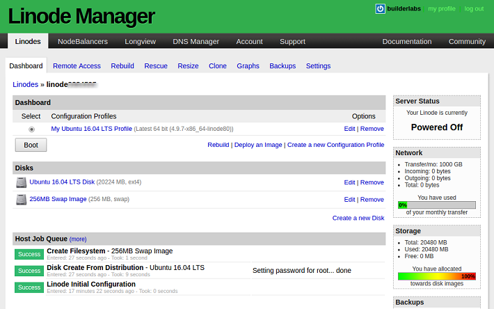
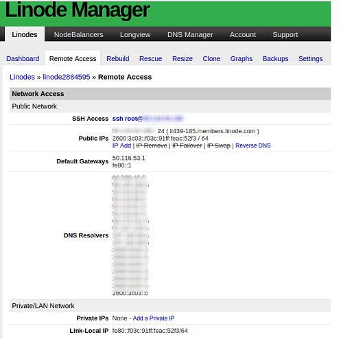
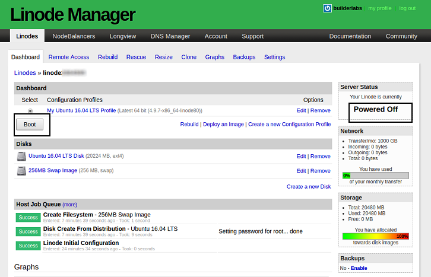

### Background:

Below are a set of instructions I have compiled for provisioning and securing  
a bare-bones Linux VPS (virtual private server) as this has become a common  
requirement of late.  

Some vendors now provide bootstrap scripts with dashboards/configuration tools  
for basic server setup steps but I felt it was important to understand the  
underlying steps involved without the overlay of these tools.  

The following key assumptions apply:  

**1). Desired Target Server & Image:** `Linux/Ubuntu`  
&emsp;*(Chosen among a plethora of available distributions)*  

**2). Vendor:** `Linode`  
&emsp;&emsp;*(Note: I happen to be a happy AWS user and recommend them highly but   
&emsp;&emsp;I'm choosing another provider to start the process from scratch and  
&emsp;&emsp;to avoid the otherwise very convenient steps such as use of my existing  
&emsp;&emsp;rsa keys for authentication, etc. Of course, I have heard heaps of  
&emsp;&emsp;praise for Linode, as well, not least because of their straightforward     
&emsp;&emsp;approach).*  

**3). Client (Local Machine) Operating System:** `Ubuntu`  
&emsp;&emsp;The instructions below assume they are being performed on some  
&emsp;&emsp;flavor of a \*nix distribution on the client machine.  To be specific, the OS  
&emsp;&emsp;commands referenced here are for Linux/Ubuntu.  Users on other \*nix  
&emsp;&emsp;distributions should be mindful of substituting their OS-equivalent commands,  
&emsp;&emsp;as a result.  

&emsp;&emsp;Windows users have multiple virtualization options at their disposal to install  
&emsp;&emsp;a virtual Linux guest on their machines (see: [Vagrant](http://www.vagrantup.com/), [VirtualBox](https://www.virtualbox.org/), [VMware](https://www.vmware.com/) ) or  
&emsp;&emsp;windows applications providing such environments (see: [Cygwin](https://www.cygwin.com/), [MinGW](http://www.mingw.org/)).  

**4). Text Editor Commands:** `vim`  
&emsp;&emsp;In the  file editing steps below I reference vim commands, as this is  
&emsp;&emsp;my editor of choice. For these steps, if you do not have vim installed,    
&emsp;&emsp;simply substitute your favorite text editor (e.g. 'nano', 'gedit', etc. )    
&emsp;&emsp;mindful of its own commands, obviously.  

  
  
*CAVEAT EMPTOR:  Requirements vary with every use-case scenario.  
The instructions listed here are meant to be an illustrative example of  
provisioning and securing a server for one particular base-case scenario.    
You should take care to note your own particular requirements for server type,  
security, and software installation and be mindful where they differ from  
the instructions presented here.*  


# I. Provision A Server

*( Note there are many options for provisioning a Linux server. [Here](https://www.cloudorado.com/cloud_providers_comparison.jsp) is a random source of cloud providers and [here](https://www.upguard.com/articles/digitalocean-vs-aws) is a source of comparison articles. Per our stated objective, we are going with Linode)*

A). SIGN UP WITH VENDOR

&emsp;Visit:  

&emsp;https://www.linode.com/  

&emsp;and create an account if you don't already have one.  

```
   Note: many vendors have free trial periods.  At  the time of this writing,  
   the option of trying Linode risk free for 7-days was available and this was  
   the option I chose.  
```
&emsp;Follow the remaining instructions to create your account (e.g., if creating a  
&emsp;Linode account for the first time, click on the link in email to activate your  
&emsp;account, etc.).  


B). SELECT AN INSTANCE TYPE

&emsp;Next, select an instance type from the menu of available ones you are  
&emsp;presented with.  I chose the simplest/cheapest:  

&emsp;`Linode 1024`

&emsp;(Note: it's conceivable that options and/or names may change over time).

C). SELECT REGION:

&emsp;I chose:

&emsp;`Newark, NJ`

&emsp;At this point, you should be presented with a 'Linode Manager' page indicating  
&emsp;that your machine is being created.  

&emsp;

&emsp;Wait until it's created - (watch for the message 'Brand New' after refreshing).  

&emsp;

D). SETUP MACHINE IMAGE:

&emsp;1). Install Operating System  
&emsp;&emsp;a). From the Linode Manager page, click on the 'Dashboard' and  
&emsp;&emsp;&emsp;under Options to the right click the 'Deploy an Image' link.

&emsp;&emsp;&emsp;Select the 64-bit Ubuntu 16.04 LTS distribution

&emsp;&emsp;&emsp;

&emsp;2). Choose a strong root password  

&emsp;&emsp;From Linode themselves:

>Enter a root password for your Linode in the Root Password field. 
This password must be provided when you log in to your Linode via SSH 
and must be at least 6 characters long and contain characters from two 
of the following categories: lowercase and uppercase case letters numbers
punctuation characters  


&emsp;3). Configure remaining details as needed (disk swap sizes, etc.)

&emsp;&emsp;For this exercise, I left default disk sizes for swapping, etc.  
&emsp;&emsp;*(Note: these are important settings which you should consider  
&emsp;&emsp;&emsp;carefully given your particular requirements).*

&emsp;&emsp;Once configuration settings have been set, you should then be met with a  
&emsp;&emsp;somewhat more detailed screen listing your configuration details that you  
&emsp;&emsp;have chosen.  

&emsp;&emsp;Of particular importance here are the items in the Host Job Queue which  
&emsp;&emsp;confirm Ubuntu 16.04 LTS as our operating system image on the machine  
&emsp;&emsp;and that the root password has been set (we'll need that to login to our  
&emsp;&emsp;server from the beginning).  

&emsp;&emsp;

&emsp;&emsp;The convenient 'Remote Access' tab lists the public ip for our machine  
&emsp;&emsp;as well as ssh access.  In my case these are:  

&emsp;&emsp;

&emsp;&emsp;SSH Access:  

&emsp;&emsp;ssh root@12.345.67.890  

&emsp;&emsp;Next, let us Boot our machine - as we can see from the Server Status  
&emsp;&emsp;section in the top right of our Dashboard, the status currently reads:  

&emsp;&emsp;"Powered Off"  

&emsp;&emsp;

&emsp;&emsp;Click Boot  
&emsp;&emsp;and 'OK' to confirm.  

&emsp;&emsp;Helpful Guide: https://www.linode.com/docs/getting-started  

&emsp;&emsp;(Note: *StackScripts* is Linode's collection of helpful scripts for server  
&emsp;&emsp;deployment, which we've purposefully avoided using here so as to get to  
&emsp;&emsp;the underlying concepts).  

&emsp;&emsp;For the steps that follow, we'll need to note our newly provisioned server's  
&emsp;&emsp;public ip address:  

&emsp;&emsp;`IP address: 12.345.67.890 `  
  
&emsp;  
  
At this point, we have successfully provisioned for ourselves a basic server  
with an Ubuntu Linux image installed.  In the next section, we walkthrough the  
very basic steps of securing the server we have just provisioned.  

# II. Secure the Server

*(Note: in the steps below we prioritize securing our freshly-minted server over
software updates/upgrades which are performed at the end of this process, once
basic security measures have been put into place.  One could choose to
perform software updates before following these security protocols.  The trade
off is an exposed server during update time (which might be negligible) versus
the (small) chance of using an outdated security package before updates.)*

A). REMOVE ATTACK VECTOR: root login

&emsp;This means creating a user profile whose name only we know which has root  
&emsp;privileges but is not the actual role: 'root' (known to everyone).  
&emsp;
&emsp;1). Start by logging in to the remote server as root (default to begin with):       
&emsp;&emsp;&emsp;&emsp;`ssh root@12.345.67.890`  
&emsp;   
&emsp;&emsp;You will get a message similar to the following:  

```
The authenticity of host 12.345.67.890 (12.345.67.890) cant be 
established. ECDSA key fingerprint is SHA256:i1rDpCRgVqjE5BJl0Xhk0...
Are you sure you want to continue connecting (yes/no)?
```

&emsp;&emsp;Answer yes to recognize our remote server and to add it to the list of  
&emsp;&emsp;known hosts.  

&emsp;&emsp;You will then see:  
&emsp;&emsp;`Warning: Permanently added '12.345.67.890' (ECDSA) to the list of known hosts.`  

&emsp;&emsp;which means that the remote server has been added to the file:  
&emsp;&emsp;`~/.ssh/known_hosts`  

&emsp;&emsp;on your local machine.  
&emsp;  
&emsp;&emsp;Immediately after this, you'll be prompted for the root password you setup  
&emsp;&emsp;during deployment with Linode.  
&emsp;&emsp;
&emsp;&emsp;Enter that password at the prompt to log in.  

&emsp;&emsp;If you remembered your password correctly, you should now be logged into  
&emsp;&emsp;your newly provisioned server and should see a prompt similar to the  
&emsp;&emsp;following:  

```
Welcome to Ubuntu 16.04.2 LTS (GNU/Linux 4.9.7-x86_64-linode80 x86_64)

 * Documentation:  https://help.ubuntu.com
 * Management:     https://landscape.canonical.com
 * Support:        https://ubuntu.com/advantage
Last login: Tue Mar  7 20:18:09 2017
root@localhost:~#
```

&emsp;  
&emsp;&emsp;This welcome message will vary over time and with the particular  
&emsp;&emsp;distribution you have chosen to install.  The important thing to note is  
&emsp;&emsp;the prompt:  
&emsp;&emsp;
&emsp;&emsp;`root@localhost:~#`  
&emsp;  
&emsp;&emsp;Our objective is to change this so we never have to login as 'root' again.

   2). To do this, we add a new user account whose profile has root privileges:

&emsp;&emsp;The following commands are Ubuntu-specific (modify them as required,  
&emsp;&emsp;particularly if working on a non-Debian derived distribution):     
&emsp;&emsp;`sudo adduser <user>`  
&emsp;  
&emsp;&emsp;*Use a strong password and store it safely (or memorize it)!*  


&emsp;&emsp;You will then be prompted to enter information for the <user>.  
&emsp;&emsp;You can fill these in as you like or just press Enter to skip filling in.  

```
root@localhost:~# sudo adduser <user>
Adding user <user> ...
Adding new group <user> (1000) ...
Adding new user <user> (1000) with group <user> ...
Creating home directory /home/<user> ...
Copying files from /etc/skel ...
Enter new UNIX password:
Retype new UNIX password:
passwd: password updated successfully
Changing the user information for <user>
Enter the new value, or press ENTER for the default
  Full Name []: <user>
  Room Number []:
  Work Phone []:
  Home Phone []:
  Other []:
Is the information correct? [Y/n] Y
```

&emsp;&emsp;Enter 'Y' when asked if the information is correct to finish adding  
&emsp;&emsp;information for our new user.  

   3). Next, we assign the new user profile root privileges:  
       
&emsp;&emsp;The commands below are specific to the vim text editor (modify them as  
&emsp;&emsp;required if vim is unavailable or you prefer another editor like nano, etc.).  
&emsp;  
&emsp;&emsp;a). Create a sudoer file as follows:  
&emsp;&emsp;&emsp;`sudo vim /etc/sudoers.d/<user>`  
&emsp;  
&emsp;&emsp;&emsp;put this line inside the file:  
&emsp;&emsp;&emsp;`<user> ALL=(ALL:ALL) ALL`  
&emsp;   
&emsp;&emsp;&emsp;This means that for the user <user> we are granting permission to run all  
&emsp;&emsp;&emsp;commands as all users and all groups from all hosts.  
&emsp;   
&emsp;&emsp;&emsp;save the file (write and quit):  
&emsp;&emsp;&emsp;`:wq`  
&emsp;   
&emsp;4). Verify the new user has been created:    
&emsp;&emsp;&emsp;`sudo cat /etc/passwd | grep <user>`  
&emsp;  
&emsp;&emsp;&emsp;this should return an entry.  
&emsp;  
&emsp;5). Switch from our root profile to the new superuser profile:  
&emsp;&emsp;&emsp;`su - <user>`  
&emsp;  
&emsp;&emsp;&emsp;Verify your prompt changes from:  
&emsp;&emsp;&emsp;`root@localhost:~#`  
&emsp;  
&emsp;&emsp;&emsp;  to:  
&emsp;&emsp;&emsp; `<user>@localhost:~$`  

&emsp;6). Now that we have a new superuser profile, we should disable logins from  
&emsp;&emsp;the user 'root'.  
&emsp;  
&emsp;&emsp;Edit the server-side sshd_config file:  
&emsp;&emsp;`sudo vim /etc/ssh/sshd_config`

&emsp;&emsp;Change the line:  
&emsp;&emsp;`PermitRootLogin yes`  
&emsp;  
&emsp;&emsp; to:  
&emsp;&emsp;`PermitRootLogin no`  
&emsp;  
&emsp;&emsp;save and quit:  
&emsp;&emsp;`:wq`

&emsp;&emsp;*(Note all work here is being done on the remote server, not your local  
&emsp;&emsp;machine.  This file is the ssh daemon configuration file which resides  
&emsp;&emsp;server-side only.  If you're only seeing ssh_config instead of  
&emsp;&emsp;sshd_config, it's likely you're on the client rather than server).*  
&emsp;  
&emsp;7). Since we changed the sshd_config configurations file, we need the new  
&emsp;&emsp;configurations to be read so we must restart the service as follows:  
&emsp;&emsp;`sudo service ssh restart`  

&emsp;8). Now exit the new superuser profile:  
&emsp;&emsp;`exit`  
&emsp;  
&emsp;&emsp;which will take you back to the 'root' profile.  Let us now exit and  
&emsp;&emsp;disconnect from the remote server:  
&emsp;&emsp;`exit`
&emsp;  

&emsp;9). Let's now confirm that root login to our server has been disabled.  
&emsp;  
&emsp;&emsp; From the local client, attempt to login as root:  
&emsp;&emsp;`root@12.345.67.890`  
&emsp;  
&emsp;&emsp;**this should fail**.  *Instead*, however, you *should* be able to log in as:  
&emsp;&emsp;`<user>@12.345.67.890`

&emsp;&emsp;(that is, if you haven't forgotten your superuser's password)!  
&emsp;  

B). REMOVE ATTACK VECTOR: password-based authentication

&emsp;Here, we remove password-based authentication as a means of external  
&emsp;access to our server due to vulnerabilities with this approach (namely,  
&emsp;weak passwords).  In this step, we will substitute Secure Shell (SSH) login  
&emsp;and make use of public key encryption as a substitute for password-based  
&emsp;authentication.  

&emsp;1). On your LOCAL (client) machine, create an ssh directory (if not there):

&emsp;&emsp;*(As stated above, the following commands assume the client operating  
&emsp;&emsp;system is some flavor of a ^nix distribution (vary these steps as required  
&emsp;&emsp;to match your own operating system requirements.  Windows clients can  
&emsp;&emsp;refer to [this](https://docs.joyent.com/public-cloud/getting-started/ssh-keys/generating-an-ssh-key-manually/manually-generating-your-ssh-key-in-windows/)).*  
&emsp;  
&emsp;&emsp;`mkdir ~/.ssh`  
&emsp;  
&emsp;&emsp;(note this is in your home directory and prefixed '.' )  
&emsp;  
&emsp;2). Now let's create a file called 'config' in this directory to which we will add  
&emsp;&emsp;our remote server's connectivity details.  If you already have one, just  
&emsp;&emsp;append the information below to the existing contents of your config file.  
&emsp;  
&emsp;&emsp;`vim ~/.ssh/config`  
&emsp;  
&emsp;&emsp;Put the following lines in this file:  
&emsp;&emsp;`Host <hostalias>`  
&emsp;&emsp;`Hostname=12.345.67.890`  
&emsp;  
&emsp;&emsp;The value next to 'Host' is the name you want to give your remote server.  
&emsp;&emsp;The value for 'Hostname' should be the public IP address you were given  
&emsp;&emsp;by the vendor for your machine.  
&emsp;  
&emsp;&emsp;save and quit:  
&emsp;&emsp;`:wq`  
&emsp;  
&emsp;&emsp;This step is meant to simplify remote logins to our server.  Whereas up  
&emsp;&emsp;until now we used the public IP address of our server to login, we can now  
&emsp;&emsp;simply use the hostname we have given our server to do this, as in:  
&emsp;  
&emsp;&emsp;`ssh <user>@<hostalias>`  
&emsp;  

&emsp;3). As a first step towards replacing password-based authentication to our  
&emsp;&emsp;server, let us now create a key pair.  You can read more on this protocol  
&emsp;&emsp;[here](https://help.ubuntu.com/community/SSH/OpenSSH/Keys).  
&emsp;  
&emsp;&emsp;Note that if you already have a key pair generated, you may skip this step  
&emsp;&emsp;and simply make use of the private key you already have. [This](https://security.stackexchange.com/questions/14983/how-often-should-an-ssh-key-pair-be-changed)  
&emsp;&emsp;discussion weighs the pros and cons of periodically renewing key pairs.  
&emsp;  
&emsp;&emsp;a). On the client (your LOCAL MACHINE) run the following command (if you  
&emsp;&emsp;&emsp;have no key pairs generated or wish to generate a new pair):  
&emsp;&emsp;&emsp;`ssh-keygen`  
&emsp;  
&emsp;&emsp;&emsp;1). By default, the encryption used is 'RSA'.  This can be changed to  
&emsp;&emsp;&emsp;&emsp;another format with the '-t' argument as follows:  
&emsp;&emsp;&emsp;&emsp;`ssh-keygen -t <encryption>`  
&emsp;  
&emsp;&emsp;&emsp;&emsp;A list of supported formats is available [here](https://en.wikipedia.org/wiki/Ssh-keygen#Key_formats_supported).  
&emsp;  
&emsp;&emsp;&emsp;&emsp;*(Yet another option is to use the -f argument to give a specific  
&emsp;&emsp;&emsp;&emsp;&emsp;name to the keys you generate here).*  
&emsp;   
&emsp;&emsp;&emsp;&emsp;Assuming the standard RSA encryption was used, this will generate  
&emsp;&emsp;&emsp;&emsp;two keys in your ~/.ssh directory:  
&emsp;&emsp;&emsp;&emsp;`id_rsa `  
&emsp;&emsp;&emsp;&emsp;`id_rsa.pub.`  
&emsp;  
&emsp;&emsp;&emsp;&emsp;Copy the contents of your **public key** id_rsa.pub (the private  
&emsp;&emsp;&emsp;&emsp;key id_rsa should remain private and on the local client).  
&emsp;  
&emsp;4). Back on the REMOTE SERVER we provisioned, create the .ssh directory  
&emsp;&emsp;under the superuser's home directory:  
&emsp;&emsp;`mkdir ~/.ssh`  
&emsp;  
&emsp;&emsp;a). Create a file called 'authorized_keys' and paste your id_rsa.pub  
&emsp;&emsp;&emsp;content into it as follows:  
&emsp;  
&emsp;&emsp;&emsp;`vim authorized_keys`  
&emsp;&emsp;&emsp;Shift + Insert&emsp;&emsp;&emsp;&emsp;[ functions as 'paste' command ]  
&emsp;&emsp;&emsp;`:wq`&emsp;&emsp;&emsp;&emsp;&emsp;&emsp;[ save and quit ]  
&emsp;  
&emsp;&emsp;b). Grant required permissions on this directory (you'll need your new  
&emsp;&emsp;&emsp;superuser password for the first one):  
&emsp;  
&emsp;&emsp;&emsp;`sudo chmod 700 ~/.ssh`  
&emsp;  
&emsp;&emsp;&emsp;[ grant user read/write/execute permissions ]  
&emsp;  
&emsp;&emsp;&emsp;`sudo chmod 644 ~/.ssh/authorized_keys`  
&emsp;  
&emsp;&emsp;&emsp;[ grant user read/write, group and others read permissions ]  
&emsp;  
&emsp;&emsp;c). Define localhost in hosts file with server IP address.  This file  
&emsp;&emsp;&emsp;establishes static associations between IP addresses and hostnames  
&emsp;&emsp;&emsp;and is read first before any DNS lookups.  
&emsp;  
&emsp;&emsp;&emsp;`sudo vim /etc/hosts`  
&emsp;  
&emsp;&emsp;&emsp;if necessary, edit the first entry that it looks like this:  
&emsp;  
&emsp;&emsp;&emsp;`127.0.0.1.1. localhost.localdomain localhost`  
&emsp;&emsp;&emsp;`:wq`  
&emsp;  
&emsp;&emsp;&emsp;*Different distributions have different requirements.  As a result, should  
&emsp;&emsp;&emsp;host resolution errors crop up downstream - when attempting to service  
&emsp;&emsp;&emsp;a request for a hosted web application, for instance - edit this file to  
&emsp;&emsp;&emsp;include the explicit IP address of your server, as follows:*  
&emsp;&emsp;&emsp;`127.0.0.1.1 localhost ip-12.345.67.890`  
&emsp;  
&emsp;5). Test ssh key pair based login.  
&emsp;  
&emsp;&emsp;a). Quit the server:  
&emsp;&emsp;&emsp;`exit`  
&emsp;    
&emsp;&emsp;b). Back on the client machine, let us ssh back to the remote server.  
&emsp;  
&emsp;&emsp;&emsp;The command to do this is as follows:  
&emsp;&emsp;&emsp;`ssh <user>@<ipAddress> -i <pathToPrivateKey>`  
&emsp;  
&emsp;&emsp;&emsp;thus:  
&emsp;&emsp;&emsp;`ssh <user>@12.345.67.890 -i ~/.ssh/id_rsa`  
&emsp;  
&emsp;&emsp;&emsp;1). Note that if you took the extra step to edit your ~/.ssh/config  
&emsp;&emsp;&emsp;&emsp;file on your local machine, our login command to the remote server  
&emsp;&emsp;&emsp;&emsp;reduces to simply:  
&emsp;&emsp;&emsp;&emsp;`ssh <user>@hostname`  
&emsp;  
&emsp;&emsp;&emsp;&emsp;thus:  
&emsp;&emsp;&emsp;&emsp;`ssh <user>@<hostalias>`  
&emsp;  
&emsp;&emsp;&emsp;&emsp;This way, you don't have to remember the IP address every time.  
&emsp;  

C). REMOVE ATTACK VECTOR: default ssh port log-in  
&emsp;  
&emsp;1). Back on the REMOTE SERVER, open the ssh config file for editing:  
&emsp;&emsp;`sudo vim /etc/ssh/sshd_config`  
&emsp;  
&emsp;&emsp;Make sure you're on the server editing /etc/ssh/sshd_config  
&emsp;&emsp;which is the ssh daemon which runs server-side. If all you see  
&emsp;&emsp;is /etc/ssh/ssh_config, you're on your local machine as this is  
&emsp;&emsp;the client side OpenSSH config file.  
&emsp;&emsp;*(More on OpenSSH: https://www.openssh.com/manual.html)*  
&emsp;  
&emsp;2). Change the ssh port from default to something else:  
&emsp;&emsp;change:  
&emsp;&emsp;`Port 22`  
&emsp;  
&emsp;&emsp;to:  
&emsp;&emsp;`Port <port>`&emsp;&emsp;[ some other *available* port of your choosing ]  
&emsp;  
&emsp;3). While we're here, let's also disallow password-based authentication:  
&emsp;&emsp;change:  
&emsp;&emsp;`PasswordAuthentication yes`  
&emsp;  
&emsp;&emsp;to:  
&emsp;&emsp;`PasswordAuthentication no`  
&emsp;  
&emsp;&emsp;Save and exit  
&emsp;&emsp;`:wq`  
&emsp;  
&emsp;4). Restart the server's ssh service as these updated configurations need  
&emsp;&emsp;to be reread for them to take effect:  
&emsp;&emsp;`sudo service ssh restart`  
&emsp;  
&emsp;5). Exit the server once again:  
&emsp;&emsp;`exit`  
&emsp;  
&emsp;6). Re-connect from the client using ssh with non-default port:  
&emsp;&emsp;`ssh <user>@XX.XX.XXX.XX -i <keyfile> -p <port>`  
&emsp;&emsp;thus:  
&emsp;&emsp;`ssh <user>@12.345.67.890  -i ~/.ssh/id_rsa -p <port>`  
&emsp;  
&emsp;&emsp;a). For greater convenience, on your LOCAL machine, add the ssh port to  
&emsp;&emsp;&emsp;our config file:  
&emsp;&emsp;&emsp;`vim ~/.ssh/config`  
&emsp;&emsp;&emsp;add the non-default port as follows:  
&emsp;&emsp;&emsp;`Port=<port>`  
&emsp;&emsp;&emsp; thus  
&emsp;&emsp;&emsp; `Port=<port>`  
&emsp;&emsp;&emsp; save and quit:  
&emsp;&emsp;&emsp; `:wq`  
&emsp;  
```
For the record, the local ~/.ssh/config file entry for our remote server  
should look something like this:  
Host <hostalias>  
Hostname=12.345.67.890  
Port=<port>  
```
&emsp;&emsp;b). To try out the simpler method, do the following.  
&emsp;&emsp;&emsp;Quit the remote server (yet again):  
&emsp;&emsp;&emsp;`exit`  
&emsp;&emsp;&emsp;Now, back on the client, with the ~/.ssh/config file edited to include  
&emsp;&emsp;&emsp;the port, simply ssh back in again as:  
&emsp;&emsp;&emsp;`ssh <user>@<hostalias>`  
&emsp;&emsp;&emsp;  
&emsp;  
D). REMOVE ATTACK VECTOR: unauthorized traffic  
&emsp;  
&emsp;With our server now *minimally* secured, it is out there, connected to and  
&emsp;accessible via the internet and as such it is prudent to be selective with any  
&emsp;incoming traffic from potentially malicious entities.  
&emsp;  
&emsp;Here, we take steps to configure firewall settings so as to permission and  
&emsp;delegate specific types of traffic/requests to their respective ports using  
&emsp;Ubuntu's Uncomplicated Firewall [UFW](https://help.ubuntu.com/community/UFW)  
&emsp;which is a high-level tool that has made the once tedious tasks of micro-  
&emsp;managing iptables for firewall configurations a thing of the past.  
&emsp;  
&emsp;While we're likely to want to allow ourselves to be able to reach out to the  
&emsp;world from our server, incoming traffic to our server is another matter  
&emsp;altogether and for which our guiding philosophy will be:  
&emsp;  
&emsp;*Start with no traffic and add on piecemeal*  
&emsp;  
&emsp;The UFW does not come enabled by default.  This means that with a fresh  
&emsp;Ubuntu Linux server set up, all traffic is enabled from the get go.  
&emsp;  
&emsp;*(Note: be sure to process each of the following commands correctly.  If  
&emsp;&emsp;you make a mistake, you will have a chance to fix it before we enable  
&emsp;&emsp;the firewall in the last step.  Before it is enabled, however, you need to  
&emsp;&emsp;make sure that you haven't setup the firewall to do unintended things -  
&emsp;&emsp;key among which would be locking yourself out of the server by disabling  
&emsp;&emsp;your chosen ssh port).*  
&emsp;  
&emsp;1). Blank Slate: reign in all traffic  
&emsp;&emsp;allow ourselves all outgoing traffic:  
&emsp;&emsp;`sudo ufw default allow outgoing`  
&emsp;&emsp;deny all incoming traffic:  
&emsp;&emsp;`sudo ufw default deny incoming`  
&emsp;  
&emsp;2). First and foremost, allow incoming ssh requests:  
&emsp;&emsp;`sudo ufw allow <port>`&emsp;&emsp;[ make sure your configured ssh port is here ]  
&emsp;  
&emsp;3). Allow http requests to our server (especially if you're going to host a  
&emsp;&emsp;web app on it):  
&emsp;&emsp;`sudo ufw allow 80`  
&emsp;  
&emsp;4). Finally, add any other incoming traffic which might be of value or  
&emsp;&emsp;importance to you.  A reference for many of these can be found [here](https://en.wikipedia.org/wiki/List_of_TCP_and_UDP_port_numbers) .  
&emsp;  
&emsp;&emsp;At a later step, we will be setting our server's timezone for network  
&emsp;&emsp;synchronization purposes.  The default port for that is 123 so we'll set  
&emsp;&emsp;the Network Time Protocol (NTP) for this as follows:  
&emsp;&emsp;`sudo ufw allow 123`  
&emsp;  
&emsp;5). With these commands processed, take a moment to look back in your  
&emsp;&emsp;command history to ensure you haven't done anything unintended.  
&emsp;&emsp;In particular, make sure you have *allowed* incoming ssh requests via  
&emsp;&emsp;the port you configured in /etc/ssh/sshd_config (originally 22).  
&emsp;  
&emsp;&emsp;Each rule is updated as you enter the command, hence the return:  
&emsp;&emsp;`Rules updated`  
&emsp;  
&emsp;&emsp;If you have made a mistake and need to change a port number, simply  
&emsp;&emsp;enter the command with the correct port number.  
&emsp;  
&emsp;&emsp;If you're all good to go, enable the firewall as follows:  
&emsp;  
&emsp;&emsp;`sudo ufw enable`  
&emsp;  
&emsp;&emsp;at which point you'll see the following prompt:  
&emsp;  
```
Command may disrupt existing ssh connections.  
Proceed with operation (y|n)?  
```
&emsp;&emsp;Answer 'y' to confirm.  You should then see a confirmation message as  
&emsp;&emsp;follows:  
&emsp;&emsp;`Firewall is active and enabled on system startup`  
&emsp;  
&emsp;Another good reference on firewall setups is available [here](https://www.digitalocean.com/community/tutorials/how-to-setup-a-firewall-with-ufw-on-an-ubuntu-and-debian-cloud-server).  
&emsp;  
To recap, if you have come this far, you have successfully:  
&emsp;  
1). Removed the 'root' profile from external logins  
2). Disabled password-based authentication in favor of the much stronger  
&emsp;public key encryption method  
3). Changed the default ssh port to something other than the default  
4). Limited all incoming traffic to only your permissioned activities and only  
&emsp;to specific ports.  
&emsp;  
*(Be mindful that the steps above comprise a *minimum* for securing a server.  
Plenty of other security issues exist and, of course, security is a hot topic  
everywhere.  [Here](https://www.thefanclub.co.za/how-to/how-secure-ubuntu-1604-lts-server-part-1-basics) is yet another non-exhaustive list of security vulnerabilities  
to consider addressing when setting up a server for the first time.)*  
&emsp;  
With these basic steps to securing your newly provisioned server, we're ready  
to address any software updates and upgrades your machine may now need.  

# III. Basic Considerations: Software & Settings  
&emsp;  
*(Now that we've taken the basic steps to secure our freshly-minted server,  
we can turn our attention to updates and upgrades of installed software.  
This is an opportune time to just go ahead and apply any/all updates as we do  
not yet have any tasks (projects/applications) running on the machine where  
updates may have unintended consequences in one or more dependencies  
in our processes).*  
&emsp;  
>TIP: When a machine is mature and has been in use, one should *not*  
automatically apply updates (though package source lists may be kept up to   
date) for precisely this reason.  If at all possible, a redundancy in the form of  
a 'dev' or backup production instance of the server should be used to test  
updated software packages in parallel to the un-updated server in order to  
pinpoint any unexpected behavior as a result of said updates and to prevent  
update-related errors from propagating to the production environment.  

&emsp;  
A). UPGRADE SOFTWARE - in Ubuntu, this is generally a painless process and is  
&emsp;as simple as issuing the following commands:  
&emsp;  
&emsp;1). update the package source lists  
&emsp;&emsp;`sudo apt-get update`  
&emsp;  
&emsp;&emsp;This command merely updates the source lists so as to indicate the newest  
&emsp;&emsp;available versions of packages.  No software is installed in this step.  
&emsp;  
&emsp;2). perform package updates:  
&emsp;&emsp;`sudo apt-get upgrade`  
&emsp;  
&emsp;&emsp;This step performs the actual download and installation of packages  
&emsp;&emsp;with reference to the source list as updated by 'update' command above.  
&emsp;  
B). (OPTIONAL/RECOMMENDED) ADDITIONAL SECURITY: fail2ban  
&emsp;  
&emsp;Now that we have our updated our server software packages, we can turn  
&emsp;our attention to non-base install packages which might be helpful.  One such  
&emsp;package is the fail2ban service, which is meant to protect against brute force  
&emsp;attacks in hacks using passwords after it detects a certain number of  
&emsp;unsuccessful login attempts.  
&emsp;  
&emsp;While we have disabled passwords and are using an ssh-based authentication  
&emsp;protocol, the ssh daemon itself is exposed to the internet when it runs, which  
&emsp;leaves it vulnerable to a potential attack from hackers.  It works by  
&emsp;auto-reconfiguring the iptable's firewall settings without bothering you but  
&emsp;can also send you reports when suspected attacks happen.  
&emsp;  
&emsp;As a result, while it's optional, it's a good idea to install this service.  
&emsp;We should also install sendmail along with it, which is the most popular  
&emsp;Unix-based email implementation and with which we can have fail2ban  
&emsp;send us reports.  
&emsp;  
&emsp;a). Since this is a non-standard package, we must specifically install it:  
&emsp;&emsp;`sudo apt-get install sendmail`  
&emsp;&emsp;`sudo apt-get install fail2ban`  
&emsp;  
&emsp;b). Configure sendmail:  
&emsp;&emsp;`sudo sendmailconfig`  
&emsp;  
&emsp;&emsp;...and answer 'Y' to prompts (for this exercise, at least).  
&emsp;  
&emsp;&emsp;since this resulted in a configuration change, we need to:  
&emsp;&emsp;`sudo service sendmail restart`  
&emsp;  
&emsp;c). Configuration files for fail2ban reside in the /etc/fail2ban directory  
&emsp;&emsp;where the file jail.conf contains standard configurations but can be  
&emsp;&emsp;overwritten in the event of an update.  
&emsp;  
&emsp;&emsp;As a result, we should create a custom configuration file that won't be  
&emsp;&emsp;overwritten by updates by copying this file and editing its contents:  
&emsp;&emsp;`sudo cp /etc/fail2ban/jail.conf /etc/fail2ban/jail.local`  
&emsp;  
&emsp;&emsp;Ideally, we would only change settings which are not dealt with in  
&emsp;&emsp;the standard configuration file but to simplify things let us edit our  
&emsp;&emsp;custom '.local' file with our email address for fail2ban reports:  
&emsp;&emsp;`sudo vim /etc/fail2ban/jail.local`  
&emsp;  
&emsp;&emsp;edit the line:  
&emsp;&emsp;`destemail = root@localhost`  
&emsp;  
&emsp;&emsp;and change it to:  
&emsp;&emsp;`destemail = <user>@localhost`  
&emsp;&emsp;`:wq`  
&emsp;  
&emsp;&emsp;`sudo service fail2ban restart`  
&emsp;  
&emsp;Info: [fail2ban](https://www.digitalocean.com/community/tutorials/how-to-protect-ssh-with-fail2ban-on-ubuntu-14-04).  
&emsp;  
C). SET TIMEZONE (RECOMMENDED):  
&emsp;  
&emsp;It's advisable to set the server timezone to UTC which is impervious to  
&emsp;changes&emsp;in Daylight Savings Time (DST) and synchronizes the timing of jobs  
&emsp;across geographic regions (for larger organizations down the line) and thus  
&emsp;makes reading logs much easier:  
&emsp;`sudo dpkg-reconfigure tzdata`  
&emsp;  
&emsp;Select:  
&emsp;`None of the Above`  
&emsp;  
&emsp;In the second page, select:  
&emsp;`UTC`    
&emsp;  
D). DETERMINE YOUR REQUIREMENTS - software requirements and use-cases  
&emsp;beyond this point tend to diverge greatly but it's likely you'll need to install some  
&emsp;helpful non-base utilities (some admins like 'finger' and a whole array of other  
&emsp;packages) as well any application-specific packages for your environment.  
&emsp;  
E). GOING FORWARD:  
&emsp;  
&emsp;1). PACKAGE UPDATES - with our basic server setup now satisfied, you should  
&emsp;&emsp;be aware that&emsp;software tends to be updated fairly regularly (some  
&emsp;&emsp;packages more so than&emsp;others).  As a result, it's a good idea to stay on  
&emsp;&emsp;top of these developments and download, install, and test upgrades  
&emsp;&emsp;when possible.  This is especially important for **security updates**.  
&emsp;  
&emsp;&emsp;It is possible to configure automatic updates known as  
&emsp;&emsp;*unattended-upgrades* in Ubuntu.  Here is a [reference](http://askubuntu.com/questions/9/how-do-i-enable-automatic-updates).  
&emsp;  
&emsp;&emsp;Another source for managing packages and software updates is [this](https://www.digitalocean.com/community/tutorials/ubuntu-and-debian-package-management-essentials).  
&emsp;  
&emsp;2). Remember: upgrade with caution  
&emsp;&emsp;As cautioned before, when the server is mature and handling production  
&emsp;&emsp;environment tasks, it's always better to first *test* updates rather than  
&emsp;&emsp;immediately rolling them out into a production environment.  

Congratulations - you have just completed one base-line provision and setup of  
a barebones Linux server.
